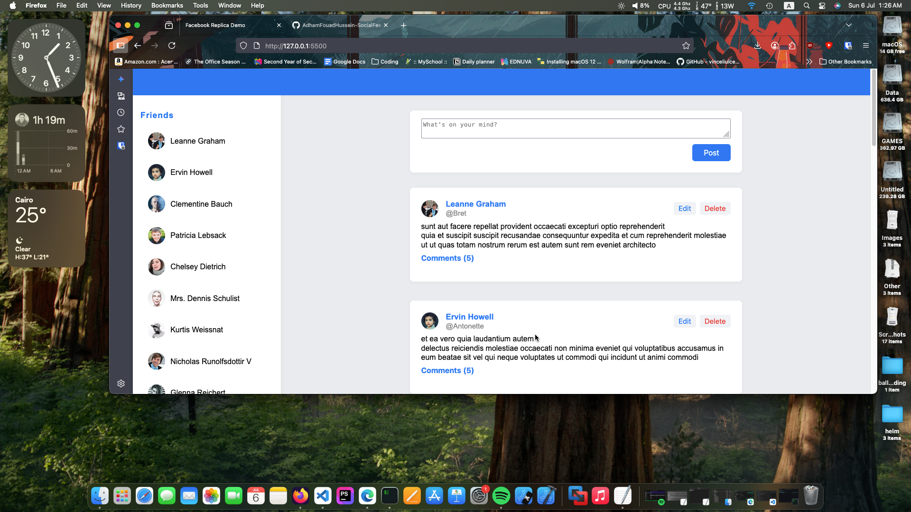

# SocialFeed-Demo (Facebook-like UI with JSONPlaceholder)

This project is a modern, responsive web app that mimics a Facebook-style social feed using the free [JSONPlaceholder](https://jsonplaceholder.typicode.com/) REST API. It is designed for learning and demonstration purposes.

[➡️ See main-explained.md for a section-by-section walkthrough of the JavaScript code.](./main-explained.md)

## Features

- **User Sidebar:** See a list of users ("friends") with avatars. On mobile, the sidebar can be toggled.
- **Feed:** By default, shows 1 post per user. Click "Show more posts" to load more from each user.
- **User Page:** Click a user to view only their posts and profile info.
- **Post Cards:** Each post displays the author's avatar, name, username, content, and comment count.
- **Comments:** Click "Comments" to expand/collapse the comments for a post.
- **Create/Edit/Delete Posts:** Add, edit, or delete your own posts (uses real API routes; changes are not persisted on JSONPlaceholder).
- **Responsive Design:** Works well on desktop and mobile devices.

## How to Use

1. **Clone or Download** this repository.
2. **Open `index.html`** in your browser. No build step is required.
3. **Try it out:**
   - Browse the feed or select a user.
   - Add, edit, or delete posts.
   - Expand/collapse comments.
   - On mobile, use the ☰ Friends button to show/hide the sidebar.

## Project Structure

- `index.html` — Main HTML file
- `style.css` — Modern, responsive styles
- `main.js` — All app logic (fetching, rendering, interactivity)
- `main-explained.md` — Section-by-section explanation of `main.js` for students

## API Reference

This project uses [JSONPlaceholder](https://jsonplaceholder.typicode.com/) endpoints:
- `GET /users` — List users
- `GET /posts` — List posts
- `GET /posts/{id}/comments` — Comments for a post
- `POST /posts` — Create a post
- `PUT /posts/{id}` — Edit a post
- `DELETE /posts/{id}` — Delete a post

> **Note:** JSONPlaceholder fakes changes for POST/PUT/DELETE. The UI updates, but the data resets on refresh.

## For Students

- See [`main-explained.md`](./main-explained.md) for a detailed walkthrough of the JavaScript code.
- Experiment with the UI and inspect the code to learn about modern web app structure, REST APIs, and responsive design.

---

**Instructor:** Adham Fouad

**Demo API:** https://jsonplaceholder.typicode.com/

**License:** [ MIT (for educational/demo use)](./LICENSE)